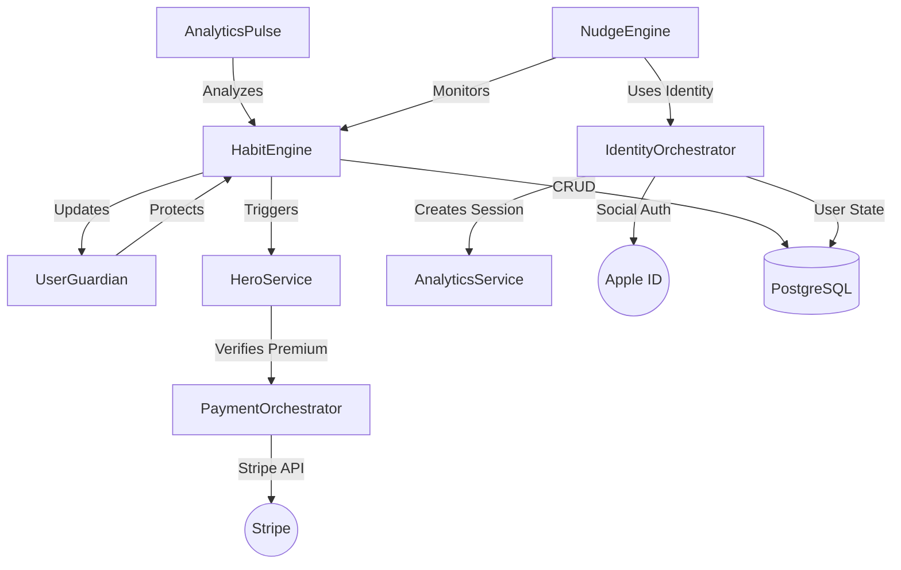

# HabitHero: Deep Module Architecture 🏗️

The HabitHero backend is built on the principle of **Deep Modules**: small interfaces that hide high internal complexity. This architecture maximizes maintainability and AI-navigability.

## 🧩 Orchestrator Roles

| Orchestrator | Primary Responsibility | Key behavioral Logic |
| :--- | :--- | :--- |
| **Identity** | Authentication | Rate limiting, Social OIDC, Session JWT. |
| **Habit** | Lifecycle | Streak calculation, XP rewards, Diff scaling. |
| **Guardian** | Safety | Burnout detection, Streak freeze protection. |
| **Hero** | Gamification | Badge granting, Leaderboard scoring. |
| **Payment** | Monetization | Subscription intents, Webhook security. |
| **Pulse** | Alignment | Identity vs. Behavior semantic mapping. |
| **Nudge** | Retention | Churn prediction, Identity-based nudges. |

---
*Designed for Locality of Logic & Production Scalability.*
